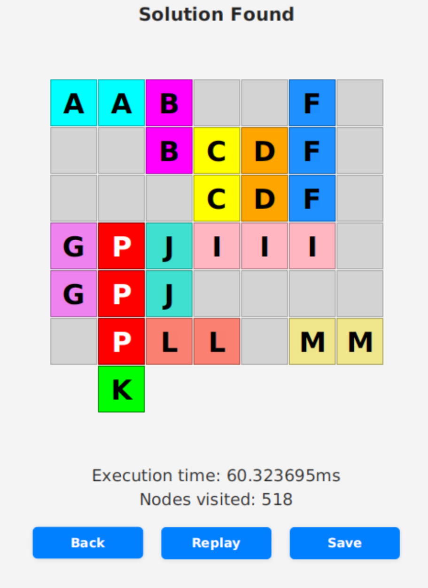

# <h1 align="center">Tugas Kecil 3 IF2211 Strategi Algoritma</h1>
<h2 align="center">Semester II tahun 2024/2025</h2>
<h3 align="center">Rush Hour Puzzle Solver with Pathfinding Algorithms</h3>

<p align="center">
  
</p>

## Table of Contents
- [Description](#-description)
- [Features](#-features)
- [Algorithms](#-algorithms)
- [Heuristics](#-heuristics)
- [Program Structure](#program-structure)
- [Usage](#-usage)
- [Author](#-author)
- [References](#-references)


## 📖 Description
This program is a Java application which is a solver for Rush Hour Puzzle. The application utilizes pathfinding algorithms such as A*, UCS, BFS and more, to look for valid solutions for a specific puzzle configuration. The resulting solution will be animated, with the ability to save the results into a text file. 

## ✨ Features
* Choose between 5 different algorithms and 3 heuristics to find the solution
* Read board configuration from txt files
* Save the solution's steps into a txt file
* Animated steps for the solution, with configurable animation delay
* The ability to replay the solution's animation


## 🧠 Algorithms
### 1. A*
A* Search combines path cost and **heuristic** evaluation to efficiently find optimal solutions by prioritizing moves that appear most promising based on both current cost and estimated distance to the goal.

### 2. GBFS
Greedy Best-First Search always explores the move move promising according to a **heuristic** function, potentially finding solutions quickly, however not guaranteeing optimality.

### 3. UCS
Uniform Cost Search explores moves in order of increasing path cost, guaranteeing the shortest solution path by prioritizing states with the lowest number of moves made so far.

### 4. IDDFS
Iterative Deepening Depth-First Search performs repeated depth-limited searches with increasing depth limits, combining the memory efficiency of DFS with the completeness of BFS.

### 5. Hill Climbing Search
Hill Climbing Search makes the locally optimal choice at each step by selecting the neighbor that improves the **heuristic** value the most. Using minimal memory, but  has the potential of getting stuck in local optima.

## 🔢 Heuristics
### 1. Blocking Cars
Blocking Cars heuristic counts the number of vehicles directly blocking the primary car's path to the exit, providing a simple estimate of minimum moves required to clear the path.

### 2. Manhattan To Exit
Manhattan To Exit calculates the minimum number of grid spaces the primary car must travel to reach the exit, measuring the direct distance without accounting for obstacles.

### 3. Combined Heuristics
Combined Heuristics merges both Blocking Cars and Manhattan Distance approaches by adding them together, creating a more informed estimate that considers both the blocking vehicles and the distance to exit.


## Program Structure
```
├── bin
├── doc
│   └── LaporanTucil3_035_117
├── LICENSE
├── makefile
├── pom.xml
├── README.md
├── src
│   ├── algorithm
│   │   ├── heuristic
│   │   │   ├── BlockingCarsHeuristic.java
│   │   │   ├── CombinedHeuristic.java
│   │   │   ├── Heuristic.java
│   │   │   └── ManhattanToExitHeuristic.java
│   │   └── pathfinding
│   │       ├── AStar.java
│   │       ├── GreedyBestFirst.java
│   │       ├── HillClimbing.java
│   │       ├── IDDFS.java
│   │       ├── Pathfinder.java
│   │       └── UCS.java
│   ├── Main.java
│   ├── model
│   │   ├── Board.java
│   │   ├── Piece.java
│   │   ├── Position.java
│   │   └── State.java
│   ├── ui
│   │   ├── GUIHelper.java
│   │   └── GUI.java
│   └── utils
│       ├── Direction.java
│       ├── InputParser.java
│       └── OutputWriter.java
└── test
```


## 🚀  Usage
### Dependencies
#### 1. Java Development Kit 
* **Version** JDK 17 or newer
* **Installation:** Get from [Oracle](https://www.oracle.com/id/java/technologies/downloads/).

#### 2. Apache Maven
* **Version:** Maven 3.6.x or newer.
* **Installation:** 
    * Option 1: Download from [official Maven website](https://maven.apache.org/download.cgi).
    * Option 2: Install with package manager (ex. `apt install maven`).

#### 3. JavaFX SDK
* **Version:** JavaFX SDK 21.0.7 .
* **Installation:**
    1.  Go to the [Gluon website (JavaFX SDK download page)](https://gluonhq.com/products/javafx/).
    2.  Download the JavaFX SDK (NOT the JMODS) for your specific operating system (Windows, macOS, Linux) and architecture.
    3.  Extract the downloaded ZIP/TAR.GZ file to a stable location on your computer (e.g., `C:\javafx-sdk-21.0.7` on Windows, or `/opt/javafx-sdk-21.0.7` on Linux/macOS).

---

###  Installation
#### Clone the Repository

```bash
git clone https://github.com/grwna/Tucil3_13523035_13523117
                        or 
git clone git@github.com:grwna/Tucil3_13523035_13523117.git
```
---

### Running the Application
❗  **Before compiling and running the application. Make sure to change `JAVAFX` path in makefile to your JavaFX installation path.**  ❗

Compile using `make build`

Run using `make run`

And use `make help` to see other available commands. 

## 👨🏻‍💻 Author
| **NIM**  | **Nama Anggota**               | **Github** |
| -------- | ------------------------------ | ---------- |
| 13523035 | M. Rayhan Farrukh              | [grwna](https://github.com/grwna) |
| 13523117 | Ferdin Arsenarendra Purtadi    | [Ferdin-Arsenic](https://github.com/Ferdin-Arsenic) |

## 📚   References
- [Spesifikasi Tugas Kecil 3 Stima 2024/2025](https://docs.google.com/document/d/1NXyjtIHs2_tWDD37MYtc0VhWtoU2wIH8A95ImttmMXk/edit?tab=t.0)
- [Slide Kuliah IF2211 2024/2025 Penentuan Rute (Bagian 1)](https://informatika.stei.itb.ac.id/~rinaldi.munir/Stmik/2024-2025/21-Route-Planning-(2025)-Bagian1.pdf)
- [Slide Kuliah IF2211 2024/2025 Penentuan Rute (Bagian 2)](https://informatika.stei.itb.ac.id/~rinaldi.munir/Stmik/2024-2025/22-Route-Planning-(2025)-Bagian2.pdf)
